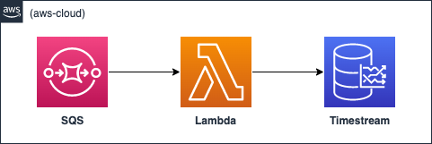

# Amazon Timestream SQS Lambda Sample Stack
This is a CDK stack written in TypeScript that sets up an AWS infrastructure to process data from an [Amazon Simple Queue Service (SQS)](https://aws.amazon.com/pm/sqs) queue and write it to [Amazon Timestream](https://aws.amazon.com/timestream) using [AWS Lambda](https://aws.amazon.com/lambda/).

## Overview

<br><br>
The stack creates the following resources:

- An SQS queue to receive data
- An Amazon Timestream database and table to store the data
- A Lambda function to process messages from the queue and write them to Timestream
- A Lambda function to generate sample data and push it to the queue

## Requirements
- [AWS CDK](https://aws.amazon.com/cdk/)
- Node.js (>= 10.3.0)
- [AWS CLI](https://docs.aws.amazon.com/cli/latest/userguide/cli-chap-welcome.html)

## Setup
1. Clone the repository.
2. Install dependencies by running `npm install`.
3. Build the TypeScript code by running `npm run build`.
4. Test the TypeScript code by running `npm test`.
5. Deploy the stack to AWS by running `cdk deploy`.

## Usage
Once the stack is deployed, you can use the sample data generator Lambda function to push sample data to the queue. The processing Lambda function will then read the messages from the queue and write them to Timestream.

The sample data generator Lambda function can be triggered manually by running the following command:

```sh
aws lambda invoke --function-name {SampleDataFunctionName} --payload {} output.json
```

## Configuration
The following environment variables can be set to customize the behavior of the stack:

- **CDK_SAMPLE_ACCOUNT**: The account this stack will deploy into. Defaults to CDK_DEFAULT_ACCOUNT.
- **CDK_SAMPLE_REGION**: The region this stack will deploy into. Defaults to CDK_DEFAULT_REGION.
- **CDK_SAMPLE_TIMESTREAM_DATA_QUEUE**: The name of the SQS queue that will receive the sample data. Defaults to TimestreamDataSQSQueue.
- **CDK_SAMPLE_TIMESTREAM_DATABASE_NAME**: The name of the Timestream database to create. Defaults to SampleTimestreamDB.
- **CDK_SAMPLE_TIMESTREAM_TABLE_NAME**: The name of the Timestream table to create. Defaults to SampleTimestreamTable.

## Clean Up
1. Remove the stack from AWS by running `cdk destroy`.

## Security

See [CONTRIBUTING](CONTRIBUTING.md#security-issue-notifications) for more information.

## License

This library is licensed under the MIT-0 License. See the LICENSE file.

